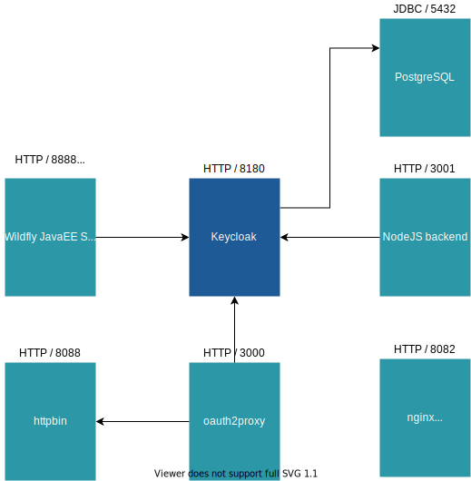

= Keycloak Techlab - Docker Compose Setup

Docker Compose based environment used by https://github.com/puzzle/keycloak-techlab[Keycloak Techlab]

== Overview of the Dockerized Lab Setup

== References

* *oauth2proxy* is based on https://github.com/oauth2-proxy/oauth2-proxy
* *js-console* client is based on https://github.com/keycloak/keycloak/tree/12.0.1/examples/js-console
* *nodejs-backend* is based on https://github.com/keycloak/keycloak-quickstarts/tree/12.0.1/service-nodejs
* *quarkus-keycloak* is based on https://quarkus.io/guides/security-keycloak-authorization
* *python-flask-oidc* is based on https://github.com/puiterwijk/flask-oidc/blob/master/example.py
